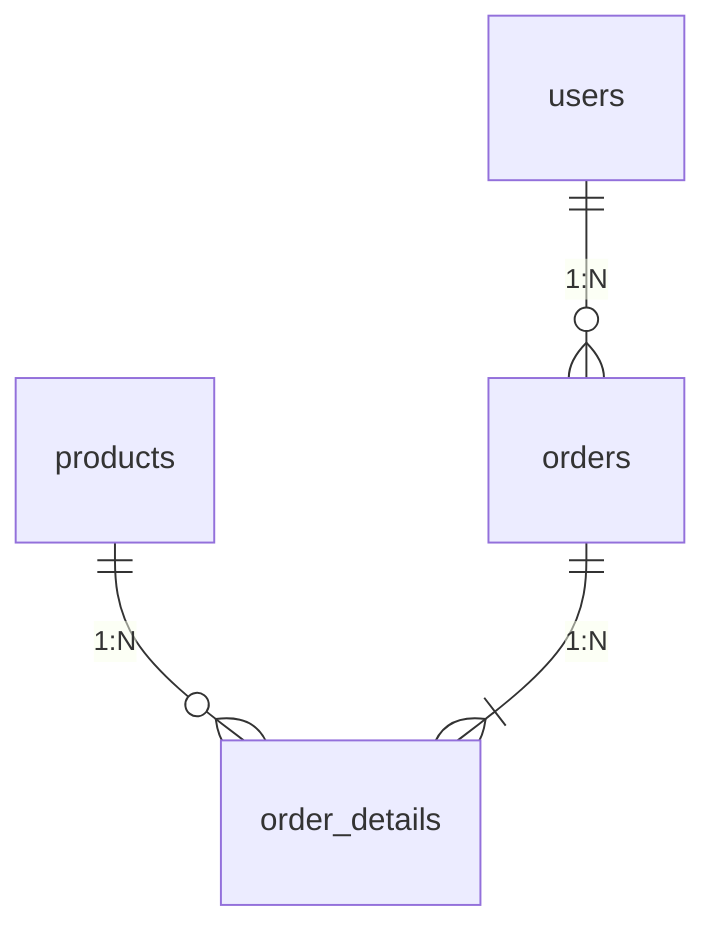

# 电商数据库设计案例

## 主要表结构

1. 用户表(users)
2. 商品表(products)
3. 订单表(orders)
4. 订单详情表(order_details)

## ER图

```mermaid
erDiagram
  users ||--o{ orders : "1:N"
  products ||--o{ order_details : "1:N"
  orders ||--|{ order_details : "1:N"
```